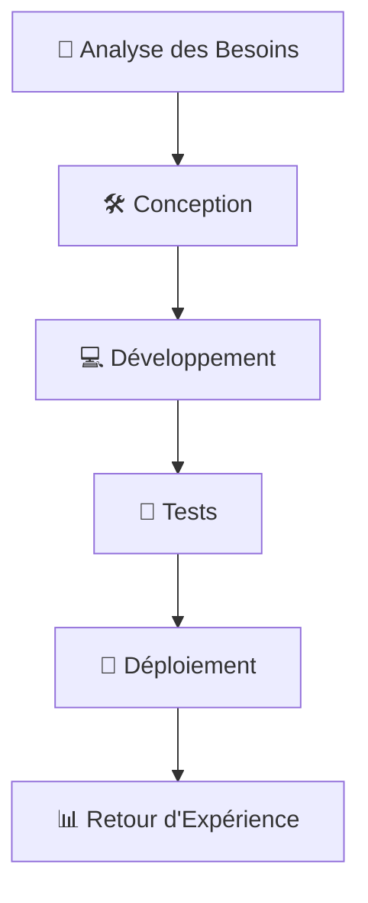

---
"🎓 Donsam Jean Gabard NOEL 🌟 Portfolio"
---

# 📌 Table des Matières
1. [👤 À propos de moi](#-à-propos-de-moi)
2. [💻 Compétences Professionnelles](#-compétences-professionnelles)
3. [🚀 Projets Académiques et Personnels](#-projets-académiques-et-personnels)
4. [💼 Expérience Professionnelle](#-expérience-professionnelle)
5. [🎓 Formations et Certifications](#-formations-et-certifications)
6. [📞 Page de Contact](#-page-de-contact)

---

# 👤 À propos de moi

> Je m'appelle **Donsam Jean Gabard NOEL** et, à 22 ans, mon parcours se définit par une double ambition : maîtriser la technologie et comprendre la loi. Actuellement en double cursus de **Licence 3 en Sciences Informatiques (IUS)** et en **Sciences Juridiques (UEH)**, je développe une expertise hybride qui allie rigueur analytique et maîtrise technique.

> Au quotidien, j'assume les responsabilités d'**Enseignant et Responsable Informatique** au Centre d'Études Abel Noël. Cette expérience me permet de piloter des infrastructures numériques concrètes tout en transmettant des savoirs technologiques complexes. Passionné par l'innovation, je me prépare à devenir un expert capable de relever les défis où le droit et l'informatique se rencontrent pour construire le monde de demain.

> "La technologie est au cœur de l'innovation et de l'éducation. 💡"

---

# 💻 Compétences Professionnelles

## 🌐 Domaines d'Expertise
- **Réseaux** 
- **Administration Système** 
- **Marketing Numérique** 

## 🛠️ Outils et Technologies Maîtrisés
- **Virtualisation** : VMware
- **Base de Données** : Access, MySQL
- **Développement Web** : HTML, CSS, JavaScript
- **Automatisation** : Python

## 💡 Langages de Programmation
-  🐍
-  🌐
-  ⚙️

## 📋 Liste des Compétences
- Gestion de projets informatiques
- Gestion de projets en Marketing Numérique
- Enseignement et formation en informatique
- Développement d'applications web

---

# 🚀 Projets Académiques et Personnels

## 🗃️ Projet 1: Base de Données pour la Gestion Scolaire
- **Description** : Création d'une base pour gérer les notes et inscriptions des étudiants.
- **Technologies** : MySQL
- **Statut** : 🚀  En cours

## 🌐 Projet 2: Site E-commerce 
- **Description** : Création d'une boutique Shopify EliteGym
- **Technologies** : Shopify
- **Statut** : ✅ Terminé

---

# 💼 Expérience Professionnelle

## 👨‍🏫 Enseignant et Responsable Informatique
**🏫 Centre d'Études Abel Noel**
- **Rôle** : Enseignement des bases de l'informatique et gestion de l'infrastructure informatique de l'école.
- **Responsabilités** :
  - Formation des étudiants et du personnel 👨‍🎓
  - Maintenance des équipements informatiques 🛠️
- **Durée** : Depuis 2023

---

# 🎓 Formations et Certifications
   Formation / Certification               | Institution | Année      |
 |-----------------------------------------|-------------|------------|
 | Licence 3 en Sciences Informatiques     | IUS         | 2023-2026  |
 | Licence 3 en Sciences Juridiques       | UEH         | 2023-2026  |
 | Certification en Marketing Numérique   | D-Clic      | 2025       |

---

# 📝 Liste de Tâches à Cocher

- [x] Finaliser la création de la base de données pour le Centre d'Études Abel Noël 🗃️
- [x] Développer un site web éducatif pour le Centre d'Études Abel Noël 🌐
- [x] Me lancer dans la création de contenu 📹
 
---

# 📊 Compétences et Projets

| Compétence / Projet               | Description                                                                 | Statut      |
|-----------------------------------|-----------------------------------------------------------------------------|-------------|
| Gestion de Base de donnée         | Création et deploiment d'une base de donnée pour une école                  | ✅ Actif   |
| Site E-commerce                   | Création d'une boutique Shopify EliteGym                                    | ✅ Terminé   |
| Enseignement Informatique         | Formation des étudiants en informatique au Centre d'Études Abel Noel.       | ✅ Actif     |

> "L'apprentissage continu et la pratique sont les clés pour exceller en informatique. 💡"

---

# 🔄 Diagramme Mermaid: Processus de Gestion de Projet

---

# 📞 Page de Contact

**📧 Email** : [donsam.noel@example.com](mailto:donsamjeangabardnoel@gmail.com)

**📞 Téléphone** : +509 3454-5832/3572-1259

**🌐 GitHub** : [github.com/donsamnoel](https://github.com/donsamnoel)

  <h3>📩 Contactez-moi</h3>
  
Pour toute question ou opportunité de collaboration, n'hésitez pas à me contacter via les liens ci-dessus. 😊

