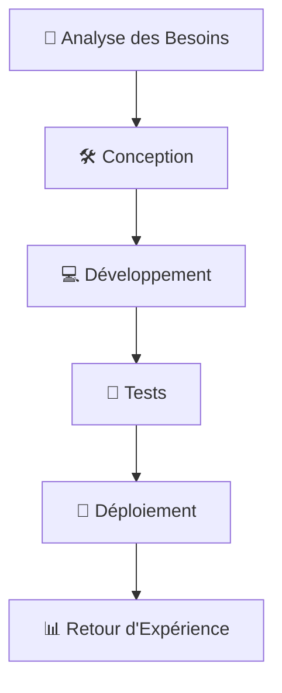

---
"🎓 Donsam Jean Gabard NOEL 🌟 Portfolio"

---

# 📌 Table des Matières
1. [👤 Profil](#-profil)
2. [💻 Compétences Professionnelles](#-compétences-professionnelles)
3. [🚀 Projets Académiques et Personnels](#-projets-académiques-et-personnels)
4. [💼 Expérience Professionnelle](#-expérience-professionnelle)
5. [🎓 Formations et Certifications](#-formations-et-certifications)
6. [📞 Page de Contact](#-page-de-contact)

---

# 👤 Profil

**👋 Nom** : Donsam Jean Gabard NOEL
**🎂 Âge** : 22 ans
**🎯 Domaine Principal** : Sciences Informatiques (Réseaux & Cybersécurité)
**📚 Éducation** : Licence 3 en Sciences Informatiques (IUS) | Licence 3 en Sciences Juridiques (UEH)
**👨‍🏫 Rôle Actuel** : Enseignant & Responsable Informatique au Centre d'Études Abel Noel

> "Passionné par l'informatique, je me spécialise dans les réseaux et la cybersécurité pour construire un avenir numérique sécurisé. 🌐🔒"

---

# 💻 Compétences Professionnelles

## 🌐 Domaines d'Expertise
- **Réseaux** 
- **Systèmes** 
- **Marketing Numérique** 

## 🛠️ Outils et Technologies Maîtrisés
- **Virtualisation** : VMware
- **Base de Données** : Access, MySQL
- **Développement Web** : HTML, CSS, JavaScript,
- **Automatisation** : Python

## 💡 Langages de Programmation
-  🐍
-  🌐
-  ⚙️

---

# 🚀 Projets Académiques et Personnels

## 🔧 Projet 1: Système de Gestion de Réseau Local
- **Description** : Conception et mise en place d'un réseau local sécurisé pour une école.
- **Technologies** : Linux, Firewall, VPN
- **Résultats** : Amélioration de la sécurité et de la performance du réseau.
- **Statut** : 🚀 En cours

## 🌐 Projet 2: Site E-commerce
- **Description** : Creation
- **Technologies** : HTML, CSS, JavaScript, PHP, MySQL
- **Lien** : [GitHub 🔗](https://github.com/donsamnoel/school-management-app)
- **Statut** : ✅ Terminé

---

# 💼 Expérience Professionnelle

## 👨‍🏫 Enseignant et Responsable Informatique
**🏫 Centre d'Études Abel Noel**
- **Rôle** : Enseignement des bases de l'informatique et gestion de l'infrastructure informatique de l'école.
- **Responsabilités** :
  - Administration des systèmes et réseaux 🌐
  - Formation des étudiants et du personnel 👨‍🎓
  - Maintenance des équipements informatiques 🛠️
- **Durée** : Depuis 2023

---

# 🎓 Formations et Certifications

| Formation / Certification               | Institution | Année      |
|-----------------------------------------|-------------|------------|
| Licence 3 en Sciences Informatiques     | IUS         | 2023-2026  |
| Licence 3 en Sciences Juridiques       | UEH         | 2023-2026  |
| Certification en Cybersécurité         | En cours    | 2026       |

---

# 📝 Liste de Tâches à Cocher

- [x] Finaliser la création de la base de données pour le Centre d'Études Abel Noël 🗃️
- [x] Développer un site web éducatif pour le Centre d'Études Abel Noël 🌐
- [x] Me lancer dans la création de contenu 📹
- [x] Ajouter une image 🖼️
- [x] Créer un tableau Markdown avec des données pertinentes 📊
- [x] Rédiger un texte avec citations 💬
- [x] Inclure un bloc de code avec spécification de langage 💻
- [x] Ajouter une syntaxe HTML 🌐
- [x] Créer un diagramme Mermaid pour illustrer un processus 🔄
- [ ]  

---

# 📊 Compétences et Projets

| Compétence / Projet               | Description                                                                 | Statut      |
|-----------------------------------|-----------------------------------------------------------------------------|-------------|
| Gestion de Réseau Local           | Configuration et sécurisation d'un réseau pour une école.                 | ✅ Terminé   |
| Application de Gestion Scolaire   | Développement d'une application pour gérer les notes et présences.         | ✅ Terminé   |
| Enseignement Informatique         | Formation des étudiants en informatique au Centre d'Études Abel Noel.       | ✅ Actif     |

> "L'apprentissage continu et la pratique sont les clés pour exceller en informatique. 💡"

---

# 🔄 Diagramme Mermaid: Processus de Gestion de Projet

---

# 📞 Page de Contact

**📧 Email** : [donsam.noel@example.com](mailto:donsamjeangabardnoel@gmail.com)

**📞 Téléphone** : +509 3454-5832/3572-1259

**🌐 GitHub** : [github.com/donsamnoel](https://github.com/donsamnoel)

  <h3>📩 Contactez-moi</h3>
  
Pour toute question ou opportunité de collaboration, n'hésitez pas à me contacter via les liens ci-dessus. 😊

